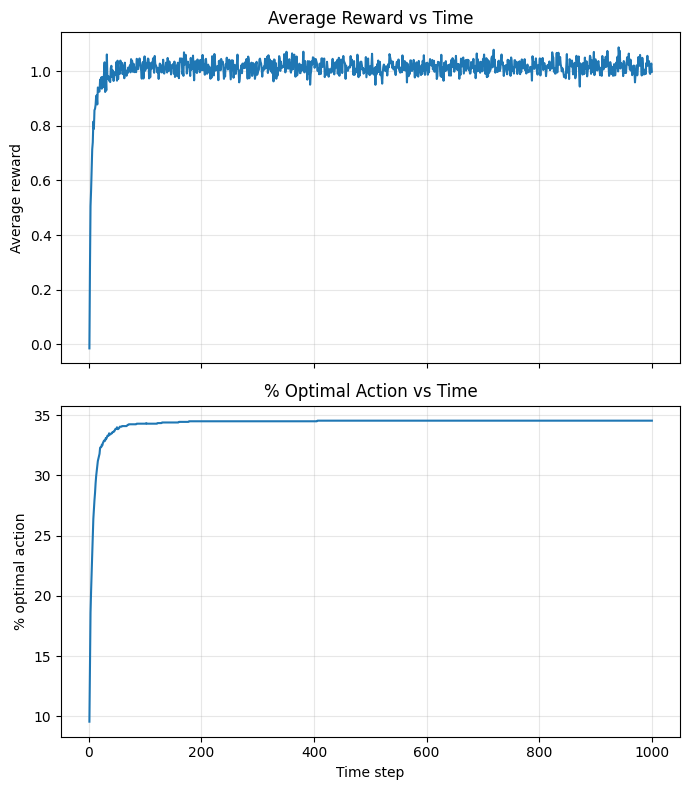
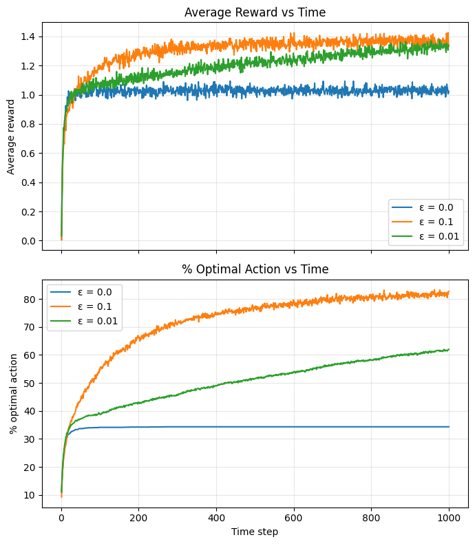
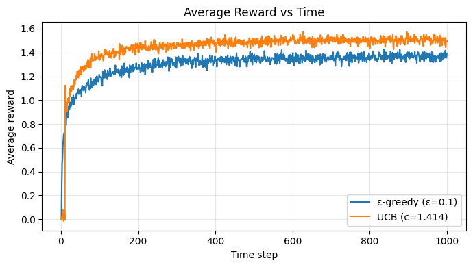
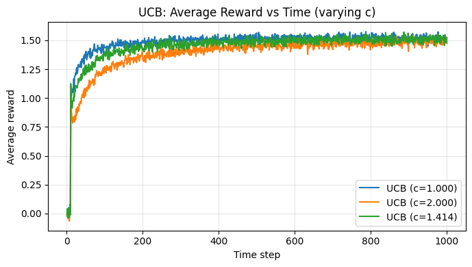
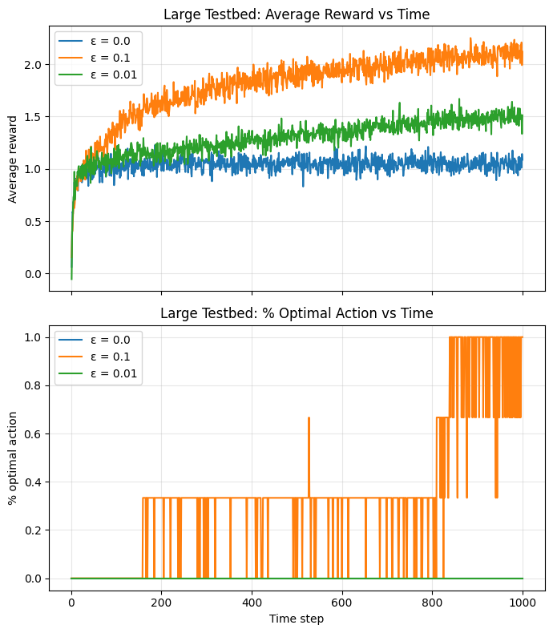
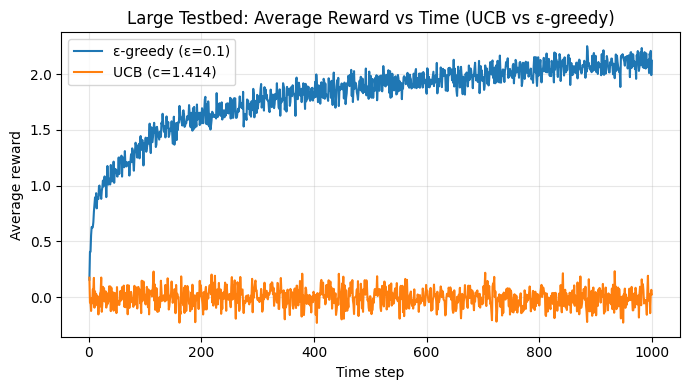
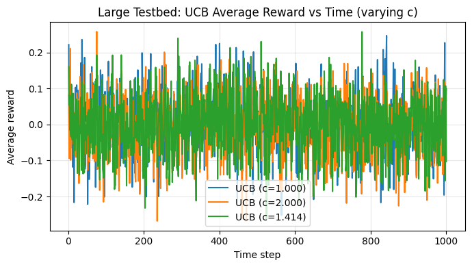

# Reinforcement Learning Programming Assignment 1
## K-armed bandit problem
Refer to the assignment [here](prog_assn_1.pdf)

### Creating the 10-armed bandit testbed with 2000 bandits
Code snippet:
```python
import numpy as np

# Testbed configuration
n_bandits = 2000
n_arms = 10
rng = np.random.default_rng(0)

# True action values q*(a) ~ N(0,1) for each bandit and arm
true_q = rng.normal(loc=0.0, scale=1.0, size=(n_bandits, n_arms))

def sample_reward(bandit_idx, action_idx):
    """Sample reward r ~ N(q*(a), 1) for one bandit and one action."""
    mean = true_q[bandit_idx, action_idx]
    return rng.normal(loc=mean, scale=1.0)

# Vectorized reward sampler for a batch of bandits/actions
def sample_reward_batch(bandit_indices, action_indices):
    """
    bandit_indices: shape (B,)
    action_indices: shape (B,)
    returns rewards: shape (B,)
    """
    means = true_q[bandit_indices, action_indices]
    return rng.normal(loc=means, scale=1.0)
```

### Greedy Algorithm (epsilon = 0)
#### Code snippet
```python
def run_greedy(true_q, n_steps, rng):
    n_bandits, n_arms = true_q.shape
    Q = np.zeros((n_bandits, n_arms), dtype=float)
    N = np.zeros((n_bandits, n_arms), dtype=int)

    optimal_actions = np.argmax(true_q, axis=1)
    avg_rewards = np.zeros(n_steps)
    pct_optimal = np.zeros(n_steps)

    for t in range(n_steps):
        # Greedy action with random tie-breaking
        actions = np.argmax(Q + rng.random(Q.shape) * 1e-8, axis=1)

        rewards = rng.normal(loc=true_q[np.arange(n_bandits), actions], scale=1.0)

        idx = (np.arange(n_bandits), actions)
        N[idx] += 1
        Q[idx] += (rewards - Q[idx]) / N[idx]

        avg_rewards[t] = rewards.mean()
        pct_optimal[t] = (actions == optimal_actions).mean() * 100.0

    return avg_rewards, pct_optimal
```

#### Plots


#### Observations
- Average reward rises quickly in the first ~50–100 steps, then stabilizes around ~1.0 with small fluctuations.
- % optimal action climbs fast early, but plateaus low (around ~34–35%). This indicates greedy often commits to a suboptimal arm and then exploits it consistently.
- After the early phase, both curves are nearly flat, showing little further improvement without exploration.

### Epsilon Greedy Algorithms
#### Code snippet
```python
def run_epsilon_greedy(true_q, n_steps, eps, rng):
    n_bandits, n_arms = true_q.shape
    Q = np.zeros((n_bandits, n_arms), dtype=float)
    N = np.zeros((n_bandits, n_arms), dtype=int)

    optimal_actions = np.argmax(true_q, axis=1)
    avg_rewards = np.zeros(n_steps)
    pct_optimal = np.zeros(n_steps)

    for t in range(n_steps):
        explore = rng.random(n_bandits) < eps

        # Greedy with random tie-breaking
        greedy_actions = np.argmax(Q + rng.random(Q.shape) * 1e-8, axis=1)
        random_actions = rng.integers(0, n_arms, size=n_bandits)

        actions = np.where(explore, random_actions, greedy_actions)
        rewards = rng.normal(loc=true_q[np.arange(n_bandits), actions], scale=1.0)

        idx = (np.arange(n_bandits), actions)
        N[idx] += 1
        Q[idx] += (rewards - Q[idx]) / N[idx]

        avg_rewards[t] = rewards.mean()
        pct_optimal[t] = (actions == optimal_actions).mean() * 100.0

    return avg_rewards, pct_optimal
```

#### Plots


#### Observations
- ε=0.1 achieves the highest average reward and highest % optimal action by the end, indicating better exploration and convergence to the best arm.
- ε=0.01 improves more slowly than ε=0.1 but eventually surpasses greedy in both reward and optimal‑action rate.
- ε=0 (greedy) stays lowest in both metrics and plateaus early, consistent with getting stuck on suboptimal arms.
- The steady gap between ε=0.1 and ε=0.01 suggests higher exploration leads to faster and better identification of the optimal arm in this stationary setting.

### UCB algorithm
#### Code snippet
```python
def run_ucb(true_q, n_steps, c, rng):
    n_bandits, n_arms = true_q.shape
    Q = np.zeros((n_bandits, n_arms), dtype=float)
    N = np.zeros((n_bandits, n_arms), dtype=int)

    optimal_actions = np.argmax(true_q, axis=1)
    avg_rewards = np.zeros(n_steps)
    pct_optimal = np.zeros(n_steps)

    for t in range(1, n_steps + 1):
        # Avoid divide-by-zero by using max(N, 1)
        bonus = c * np.sqrt(np.log(t) / np.maximum(N, 1))
        ucb = Q + bonus
        ucb[N == 0] = np.inf  # force trying unvisited arms

        actions = np.argmax(ucb + rng.random(Q.shape) * 1e-8, axis=1)
        rewards = rng.normal(loc=true_q[np.arange(n_bandits), actions], scale=1.0)

        idx = (np.arange(n_bandits), actions)
        N[idx] += 1
        Q[idx] += (rewards - Q[idx]) / N[idx]

        avg_rewards[t - 1] = rewards.mean()
        pct_optimal[t - 1] = (actions == optimal_actions).mean() * 100.0

    return avg_rewards, pct_optimal
```

#### Plots


#### Observations
- UCB (c≈1.414) quickly overtakes ε‑greedy and stays higher throughout, indicating more effective exploration and exploitation in this setting.
- Both methods rise sharply early on and then plateau, but UCB converges to a higher steady‑state average reward (~1.5 vs ~1.35–1.4).
- The gap between the curves remains fairly stable after the initial phase, suggesting UCB consistently finds better arms rather than just learning faster.

### UCB algorithm with varying c value


#### Observations
- All three c values converge to a similar long‑run average reward (~1.5), indicating UCB is robust to moderate changes in c.
- Smaller c (1.0) reaches high reward faster early on, suggesting less exploration and quicker exploitation.
- Larger c (2.0) starts slower due to more exploration, but gradually catches up, showing the trade‑off between early speed and exploratory coverage.

### Inferences
- Pure greedy (ε=0) quickly stabilizes but at a low % optimal action and lower average reward, indicating early commitment to suboptimal arms due to lack of exploration.
- ε‑greedy with ε=0.1 yields the highest average reward and % optimal action among the ε‑greedy variants, showing that sustained exploration improves long‑run performance in this stationary setting.
- ε=0.01 improves over greedy but converges more slowly and to a lower optimal‑action rate than ε=0.1, reflecting insufficient exploration to reliably discover the best arm early.
- The gap between ε=0.1 and ε=0.01 remains after the transient phase, implying that the exploration rate affects not just speed of learning but the final steady‑state performance over 1000 steps.
- UCB (c≈√2) outperforms ε‑greedy (ε=0.1) in average reward, suggesting its exploration is more targeted and efficient than random exploration.
- UCB with smaller c reaches higher reward faster early on, while larger c learns more slowly, indicating the usual exploration–exploitation trade‑off.
- Despite different c values, UCB curves converge to similar long‑run rewards, showing robustness of UCB to moderate changes in c on the 10‑armed task.

### Conjectures
- Greedy underperforms because early noise in reward estimates locks it into a suboptimal arm; without exploration, it has no mechanism to recover.
- ε=0.1 strikes a better balance because it explores frequently enough to correct early mistakes but still exploits the best‑known arm most of the time.
- ε=0.01 explores too little to consistently identify the optimal arm within 1000 steps, leading to a lower steady‑state reward than ε=0.1.
- UCB’s advantage over ε‑greedy comes from prioritizing uncertain arms rather than random exploration, which reduces wasted samples and accelerates identification of the optimal arm.
- The similar asymptotic UCB performance across c values suggests that once each arm has been sampled enough, the confidence bonuses shrink and all settings behave near‑greedy on the optimal arm.
- If the horizon were much longer, ε‑greedy might continue to suffer a small “exploration cost,” while UCB would asymptotically approach optimal behavior with less persistent random exploration.
- If rewards were non‑stationary, ε‑greedy might become more competitive (or even better) because its constant exploration adapts, whereas UCB could become over‑confident in stale estimates.

### Experiments with a large testbed (10k arms and 300 bandits)
#### Epsilon-greedy algorithms


##### Observations
- In the large testbed, ε=0.1 achieves the highest average reward throughout, showing that more exploration is crucial when there are 10,000 arms.
- ε=0 (greedy) quickly plateaus at a much lower reward, indicating early commitment to suboptimal arms is even more harmful at large scale.
- The “% optimal action” plot stays near zero and is noisy/spiky, which is expected with 10k arms and fewer bandits—hitting the true best arm is rare and the estimate is high‑variance.

#### UCB vs epsilon greedy


#### Observations
- In the 10,000‑armed setting, ε‑greedy (ε=0.1) quickly climbs to high average reward, while UCB (c≈1.414) stays near zero, indicating UCB is failing under this scale/configuration.
- The persistent gap suggests UCB’s exploration bonus is too aggressive or too slow to accumulate reliable estimates when there are many arms and limited steps/bandits.
- ε‑greedy’s random exploration is more effective here because it samples broadly and can stumble onto high‑value arms even without strong uncertainty estimates.

#### UCB with varying c value


#### Observations
- All UCB curves (c=1.0, 1.414, 2.0) hover around zero average reward with high noise, showing no meaningful learning in the large‑arm setting.
- The three lines heavily overlap, indicating that changing c does not materially improve performance when there are 10,000 arms and limited steps.
- The fluctuations are centered near 0, which is consistent with repeatedly sampling near‑random arms whose true means are ~N(0,1).


